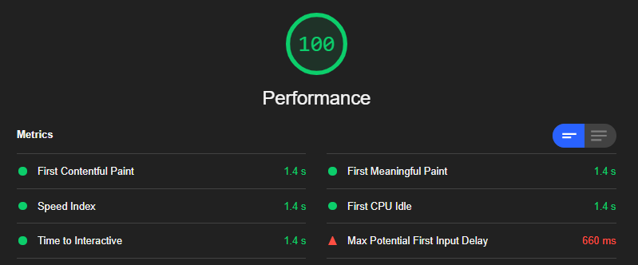

# Spotify Artists Best-Of Showcase

The code of the project used was from the 13th of march. The code from the original repo may differ. 
[Click here to view the forked repo](https://github.com/meessour/web-app-from-scratch-1920)

## Demo's

[Live Demo](https://popular-track-generator.herokuapp.com/)

<details>
<summary>How to install</summary>

**Step 1:** Clone project:
```git
git clone https://github.com/meessour/progressive-web-apps-1920.git
```

**Step 2:** CD to path of the project's root:
```git
cd C:/../..
```

**Step 3:** Install packages:
```git
npm install
```

**Step 4:** Start the server:
```git
npm start
```

**Step 5:** Navigate to: http://localhost:8080/
</details>

## Progressive Web App
Once the install prompt of the app is stashed, it wil show a button with the text "Install app".
It will fire the prompt once the user clicks this button
```javascript
window.addEventListener("beforeinstallprompt", function (e) {
    // Prevent the mini-infobar from appearing
    e.preventDefault();
    // Stash the event so it can be triggered pnglater.
    deferredPrompt = e;
    // Update UI notify the user they can install the PWA
    showInstallPromotion();
});

```

Once the app is installed or when the app was already installed, it will hide the button.

### Job stories
* When I'm offline I want to be notified by the app so I know why certain features are not working.
* When i'm offline and want to use a feature where internet is required, I want to be notified that I'm offline
* I want to be able to install the app so I can have a progressive enhanced web app experience

### Offline
When the user suddenly goes from online to offline while in the app, the app shows this message:

This will also show when i'm trying to use an online feature but the user is offline. This gets checked with the following code:
```javascript
if (!navigator.onLine) {
    showOfflineMessage();
} else {
    ...
}
```
When the user goes from offline to online while in the app the app shows the following message:


###Perceived load speed
Before the app needed to load fonts and icons from google:

<details>
<summary>What the performance rating was before</summary>


</details>

This was the code responsible:

```html
<!-- Font -->
<link href="https://fonts.googleapis.com/css2?family=Montserrat:wght@100;200;300;400;500;600;700;800;900"
          rel="stylesheet">
```

Fallback font is Arial. This way all text on the site isn't dependend from the custom font. So when the font isn't loaded yet, it will show the Arial font (looks the most like the custom font)  instead:
```css
font-family: Montserrat, Arial, sans-serif;
```

To get this to work, I included ```&display=swap``` at the end of the href from the source of the custom font. This way a system font will load and when the custom font is loaded in, it will swap the system font with the custom font.

```html
<link href="https://fonts.googleapis.com/css2?family=Montserrat:wght@100;200;300;400;500;600;700;800;900&display=swap"
              rel="stylesheet">
```

I also included ```defer``` tags to all scripts. This means the script will load when the whole page is loaded. I didn't use ```async``` because ```user_feedback.js``` is dependent of ```script.js``` and that one is dependent of the ```jquery``` script

```html
    <!-- jquery -->
    <script defer src="/js/jquery-3.4.1.min.js"></script>

    <script defer type="module" src="/js/script.js"></script>
    <script defer type="module" src="/js/user_feedback.js"></script>
```


<details>
<summary>What the performance rating was after</summary>



</details>

The MPFID is 660ms now. This is because the longest request van take up to 660ms. I currently request all songs and load them all in at once. A solution would be to load it in, in parts. Too bad this isn't possible because the server needs to parse data, and in order to do that I need all the songs. Fetching all the songs takes a while because sometimes there can be up top 5000 songs. 

<details>
<summary>Performance</summary>


</details>

In order to reduce the size of the content that's being served, I use minifyHTML.

```javascript
.use(minifyHtml({
    override: true,
    exception_url: false,
    htmlMinifier: {
        removeComments: true,
        collapseWhitespace: true,
        collapseBooleanAttributes: true,
        removeAttributeQuotes: true,
        removeEmptyAttributes: true,
        minifyJS: true
    }
}))
```

###Accessibility

The Accessibility results before were 47.

<details>
<summary>Accessibility before</summary>


</details>

The first optimisation is a contrast issue. I have a user-feedback section which I hide when not used. I hide it by giving the container: ```height: 0px```. Once I want to show the feedback, I assign the color red or green to it and then show the animation. I have no standard fallback color for this container:

<details>
<summary>No background color</summary>


</details>

To fix this potential contrast issue that could occur, I give the standard background color a darker color:

```css
.user-feedback {
    background-color: var(--dark);
}
```

Now the Accessibility is 53

<details>
<summary>Accessibility after first optimisation</summary>


</details>

The seccond optimisation is used for a experience enchanmend. Some people use assistive technology to use your site. A good exmaple is a screenreader. Currently it is not clear what the content of my images are, because I only include elements used for CSS and a source link:

```html

```

In order for a screenreader to read such an image, I will use ```alt``` to provide context for the screenreader.

**Good practices:**

Here are some good practices to use when providing an ```alt``` text (Source: https://web.dev/image-alt/?utm_source=lighthouse&utm_medium=devtools):

* alt text should give the intent, purpose, and meaning of the image.
* Blind users should get as much information from alt text as a sighted user gets from the image.
* Avoid non-specific words like "chart", "image", or "diagram".

Here are a few examples of alt texts:

```html


```

Now the score is 80.

The last optimisation opportunity also has to do with assistive technology (like a screenreader). For my app I have a searchbar with a placeholder in it:

```html
<input id="artist-name-input" class="artist-search-input" type="text" list="word-list" placeholder="Search for artist...">
```
A screenreader doesn't use this property but uses a associated label. My idea was to add a label and then add the following style: ```style="visibility: hidden"```. This way the label was still in the page but not visible onscreen:

```html
<label for="artist-name-input" style="visibility: hidden">Search for an artist:</label>
<input id="artist-name-input" class="artist-search-input" type="text" list="word-list" placeholder="Search for artist...">
```

The test did not succeed... My other plan was to use the website title as label. Before:

```html
<h1>Search the most popular tracks of your favorite artist</h1>
```
I wrapped the text in a ```label``` and gave it ```for="artist-name-input"``` so it is associated with the input. After:
```html
<h1><label for="artist-name-input">Search the most popular tracks of your favorite artist</label></h1>
```

Now the score is 100.

### Best Practices
I scored 86 on this.

<details>
<summary>Best Practices before</summary>


</details>

The first thing that could be imporved has to do with safety. A track can be clicked and the user will be redirected to the page of that site in a new tab with: ```target="_blank"```. This will expose my site to performance and security issues. 

These are some issues (source: https://web.dev/external-anchors-use-rel-noopener/?utm_source=lighthouse&utm_medium=devtools
):

* The other page may run on the same process as your page. If the other page is running a lot of JavaScript, your page's performance may suffer.

* The other page can access your window object with the window.opener property. This may allow the other page to redirect your page to a malicious URL.

To overcome this issue, I simply add ```rel="noopener"``` as ab attribute. No the element looks like this:

```html
<a class="track-action" 
href="https://open.spotify.com/track/0ngZueOdVd4rso8cEAtz6V" 
target="_blank" 
rel="noopener"></a>
```

Now the score is 93.

## Licence
MIT © [Mees Sour](https://github.com/meessour)
